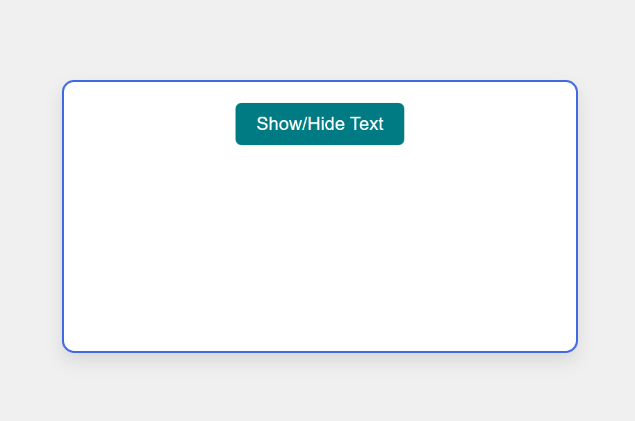
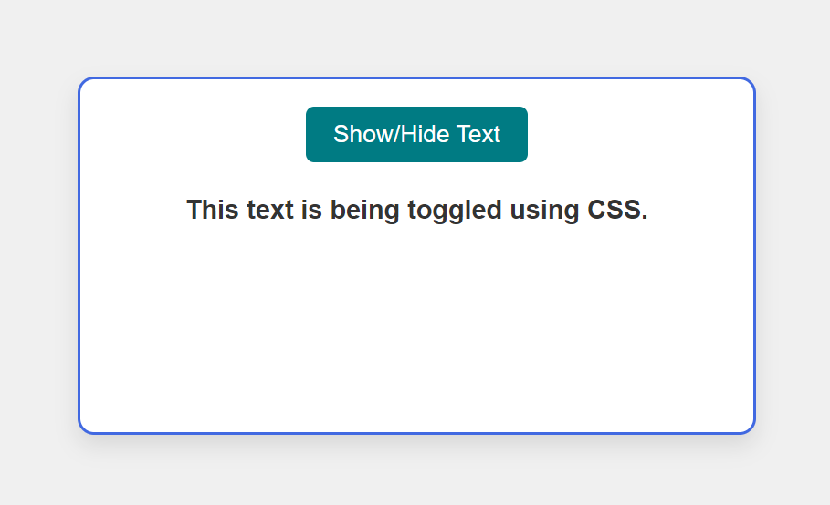

# Hide/Display Text using CSS

This is a simple HTML project that demonstrates how to toggle the visibility of text using CSS and a checkbox. The text is hidden by default and can be shown or hidden by clicking the "Show/Hide Text" button.

## Features

- Toggle text display using CSS and checkbox input.
- Minimalistic design.
- Easy to implement and customize.

## How It Works

- The text is initially hidden.
- When the checkbox is clicked, the text becomes visible.
- Clicking the checkbox again hides the text.

## Usage

1. Download or clone this repository.
2. Open the `index.html` file in a web browser.
3. Click the "Show/Hide Text" button to toggle the text visibility.

## Screenshots

### 1. Before Toggling



This is how the interface looks when the text is hidden.

### 2. After Toggling



This is how the interface looks when the text is visible.

## Code for Toggle Display Functionality

```html
<html>
<head>
  <style>
    .textToggle {
      display: none;
    }

    #toggle:checked ~ .textToggle {
      display: block;
    }

    #toggle {
      display: none;
    }
  </style>
</head>
<body>
  <div class="main">
    <label for="toggle">Show/Hide Text</label>
    <input type="checkbox" id="toggle">
    <h3 class="textToggle">This text is being toggled using CSS.</h3>
  </div>
</body>
</html>